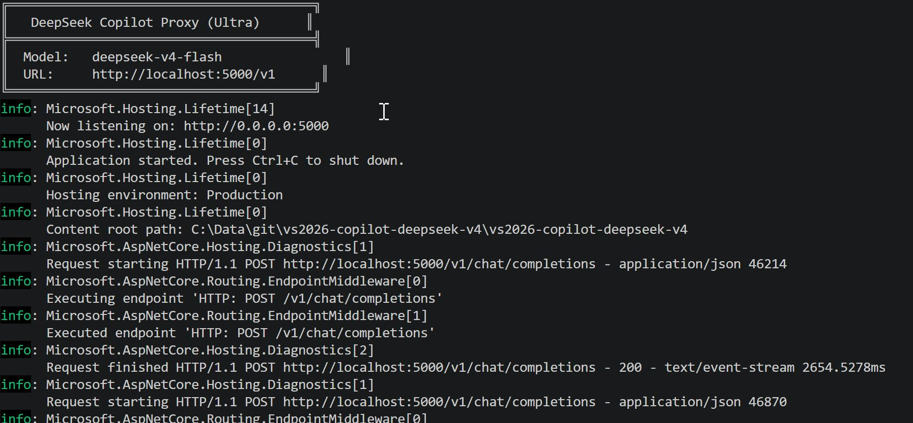
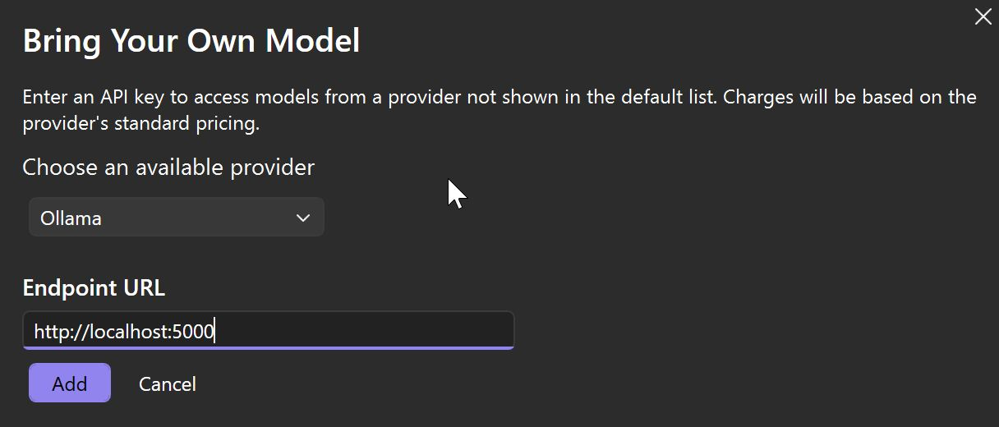
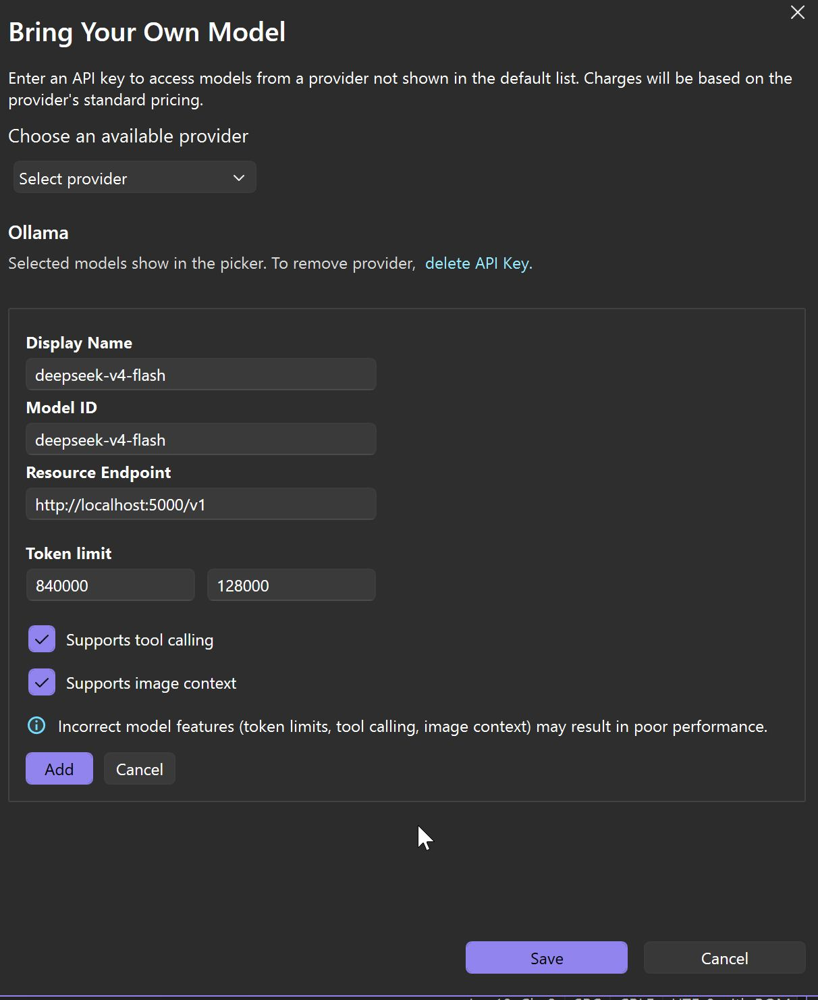
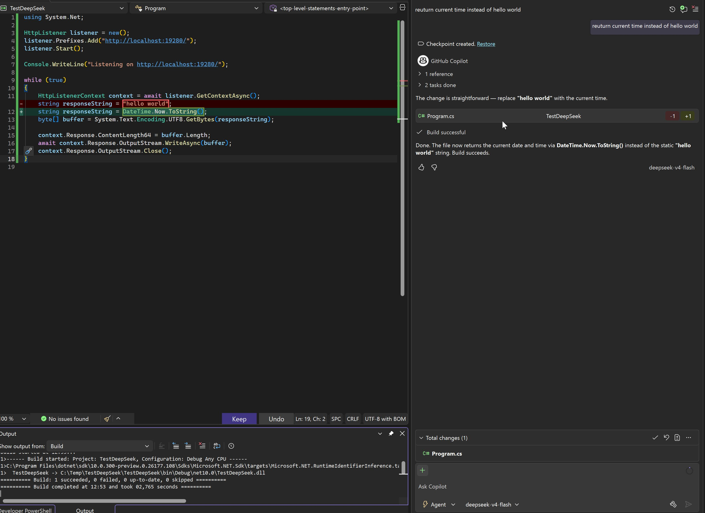

# C# DeepSeek Github Copilot Proxy for Visual Studio 2026 Ollama Provider 

as of 9. May 2026 use Visual Studio Insider Version

**Why?**

See 
DeepSeek V4 AI Beats Billion Dollar Systems…For (almost) Free

https://www.youtube.com/watch?v=p7K3xfViWCE

A high-performance, ultra-low-overhead HTTP proxy that connects GitHub Copilot and Ollama clients to the **DeepSeek** API. Built with .NET 10 and ASP.NET Core minimal APIs for maximum throughput and minimal allocations.

| 🏷️ | Details |
|---|---|
| **Author** | iqmeta GmbH — Otto Neff |
| **Version** | `2026.05.09` |
| **Model** | `deepseek-v4-flash` (configurable) |
| **Default Port** | `5000` |
| **Framework** | .NET 10 |

---

## Screenshots

<p align="center">
  
  
</p>
<p align="center">
  
  
</p>


## Features

- **🧠 Reasoning Content Caching** — Automatically captures DeepSeek's `reasoning_content` from streaming and non-streaming responses, and re-injects it on subsequent assistant messages for true multi-turn reasoning.
- **🔄 Dual API Compatibility**
  - **OpenAI-compatible** endpoint (`POST /v1/chat/completions`) — works with GitHub Copilot, Cursor, Continue.dev, and any OpenAI SDK.
  - **Ollama-compatible** endpoints (`GET /api/tags`, `POST /api/chat`) — works with any Ollama client.
- **⚡ Ultra-Performance** — Uses `SocketsHttpHandler` with connection pooling (256 connections/server, HTTP/2 multiplexing), `SlimBuilder`, and pass-through streaming.
- **📦 Zero Allocation Streaming** — SSE (Server-Sent Events) are streamed through without buffering, with minimal allocations during parsing.
- **🔌 No External Dependencies** — Uses only built-in ASP.NET Core and `System.Text.Json`; YARP is included but unused for the core proxy functionality.

---

## Quick Start

### Prerequisites

- [.NET 10 SDK](https://dotnet.microsoft.com/download/dotnet/10.0)
- A DeepSeek API key

### 1. Configure API Key

Open `Program.cs` and set your DeepSeek API key:

```csharp
const string API_KEY = "sk-your-deepseek-api-key-here";
```

You can also change the model and port:

```csharp
const string MODEL = "deepseek-v4-flash";   // or "deepseek-chat", etc.
const int PORT = 5000;
```

### 2. Run

```bash
dotnet run
```

You should see:

```
╔════════════════════════════════════════╗
║   DeepSeek Copilot Proxy (Ultra)      ║
╠════════════════════════════════════════╣
║  Model:   deepseek-v4-flash            ║
║  URL:     http://localhost:5000/v1      ║
╚════════════════════════════════════════╝
```

---

## Endpoints

### Health Check

```http
GET /health
```

Response:
```json
{ "status": "ok", "model": "deepseek-v4-flash" }
```

### List Models (OpenAI-style)

```http
GET /v1/models
```

### Chat Completions (OpenAI-style)

```http
POST /v1/chat/completions
```

Full OpenAI chat completions API — supports both streaming (`stream: true`) and non-streaming modes. Handles tool calls, multi-turn reasoning, and vision (image) inputs.

### Ollama API

```http
GET /api/tags
POST /api/chat
```

Converts Ollama's message format to OpenAI format transparently and proxies to DeepSeek. Supports `messages`, `tools`, `stream`, and `images` (vision).

---

## Configuration Guide

### GitHub Copilot

Configure your Copilot client to use the proxy:

```json
{
  "github.copilot.advanced": {
    "debug.chatOverride": {
      "provider": "openai",
      "endpoint": "http://localhost:5000/v1/chat/completions",
      "model": "deepseek-v4-flash"
    }
  }
}
```

### Ollama

Point any Ollama client to the proxy:

```bash
ollama run deepseek-v4-flash --api http://localhost:5000/api/chat
```

Or use the OpenAI compatibility mode with Ollama clients:

```bash
OLLAMA_HOST=http://localhost:5000 ollama serve
```

### Continue.dev / Cursor

Configure the OpenAI-compatible endpoint:

```json
{
  "models": [{
    "title": "DeepSeek V4",
    "provider": "openai",
    "model": "deepseek-v4-flash",
    "apiBase": "http://localhost:5000/v1"
  }]
}
```

---

## How Reasoning Caching Works

DeepSeek responses include a `reasoning_content` field containing the model's chain-of-thought. This proxy:

1. **Captures** the reasoning from each assistant response (both streaming and non-streaming).
2. **Keys** the reasoning by assistant message index or tool call IDs.
3. **Re-injects** cached reasoning into subsequent assistant messages in the same conversation.
4. **Preserves existing** `reasoning_content` — if a message already has it, it won't be overwritten.

This enables coherent multi-turn reasoning conversations without losing context between turns.

---

## Performance Tuning

The `SocketsHttpHandler` is configured for maximum throughput:

| Setting | Value | Purpose |
|---|---|---|
| `MaxConnectionsPerServer` | 256 | High concurrency |
| `PooledConnectionLifetime` | 5 min | Connection reuse |
| `KeepAlivePingDelay` | 30 sec | Keep connections alive |
| `PooledConnectionIdleTimeout` | 30 sec | Free idle connections |
| `EnableMultipleHttp2Connections` | `true` | HTTP/2 multiplexing |

Adjust these in `Program.cs` based on your workload.

---

## Architecture

```
┌──────────────┐     ┌─────────────────────────────────┐     ┌───────────────┐
│  Copilot /   │────▶│  DeepSeek Copilot Proxy         │────▶│  api.deepseek │
│  Ollama CLI  │     │  (localhost:5000)                │     │  .com         │
│              │◀────│  - Reasoning caching             │◀────│               │
│              │     │  - Format translation            │     │               │
│              │     │  - Streaming proxy               │     │               │
└──────────────┘     └─────────────────────────────────┘     └───────────────┘
```

<p align="center">
  
</p>

The proxy is a single-file .NET application using:
- `Microsoft.AspNetCore` — Minimal API hosting
- `System.Text.Json` — JSON parsing with snake_case policy
- `System.Net.Http.SocketsHttpHandler` — High-performance HTTP transport

---

## License

WTFPL (Do What The Fuck You Want To Public License)

---

## Disclaimer

This is a proxy tool intended for development use. Ensure compliance with DeepSeek's terms of service and your API usage policies.
